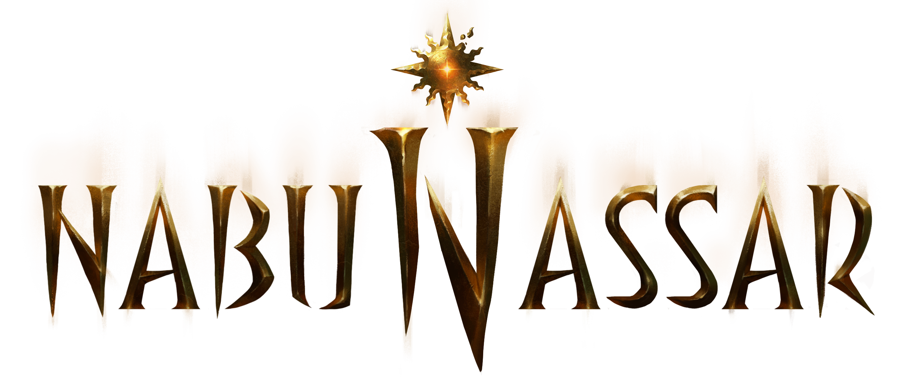

# Характеристики
Любое существо описывается четырьмя базовыми характеристиками:

* Телосложение
* Ловкость
* Интеллект
* Диалектика

Каждая характеристика может принимать значение от d4 до d12, и может быть изменена только *на время*.

## Относительные значения
Не смотря на то, что человек с телосложением d12 считается невероятно сильным и выносливым, существо другого типа, например, Дракон с телосложением d8 обладает на много большей выносливостью и силой относительно человека.
Поэтому, при определении характеристик следует учитывать относительное значение внутри типа существ, а не снаружи.

## Рассчёт относительного значения
В обычном случае при рассчёте бонусов от характеристик следует учитывать абсолютную шкалу *типа* существ от d4 до d12, где:
* d4 - существо самого `слабого` ранга, с поделённым на треть общим значением бонусов 
* d6 - существо `малого` ранга с половинным значением бонусов характеристик
* d8 - существо `нормального` ранга с обычным значением бонусов 
* d10 - существо `крупного`ранга с удвоенными значениями бонусов
* d12 - существо `большого` силы с увеличенными в три раза значениями бонусов характеристик

## Состязания
Тип проверки
При состязании существ одинакового типа значение костей считаются абсолютными, если же состязаются существа разного типа, то у существа меньшего типа есть возможность выиграть состязание только при условии, что выпавшее значение будет выше, чем `dR+DdR`, где R - это кость типа противника, D - разница рангов по модулю.
Чтобы существо меньшего ранга проиграло проверку само, выброшенное значение должно быть меньше чем `dR-DdR`, в то время как значение противника должно быть больше.
Эти же правила работают для Толпы, применяясь к `результату броска`.
> Например, если _Человек_ (существо нормального типа d8) с силой d12 соревнуется с _Огром_ (существом d10) силой d6, то, чтобы выиграть состязание он должен выбросить минимум `20` (`d10+1d10`) чтобы победить, при условии, что значение будет больше, чем выпавшее значение _Огра_. А чтобы _Огр_ сам проиграл состязание, ему нужно выбросить < `16` (`d8+1d8`).

Таким образом, "чистое" состязание характеристик не может быть выиграно существом меньшего типа, но при состязаниях навыков это становится возможным.