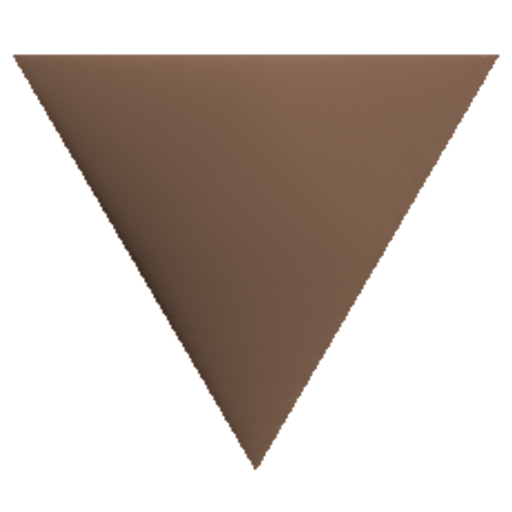
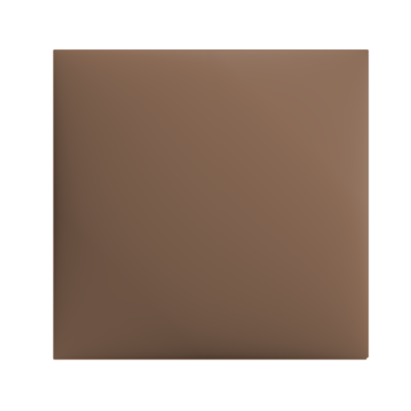
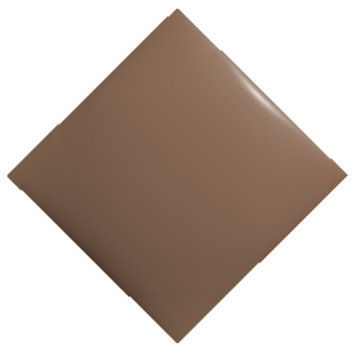
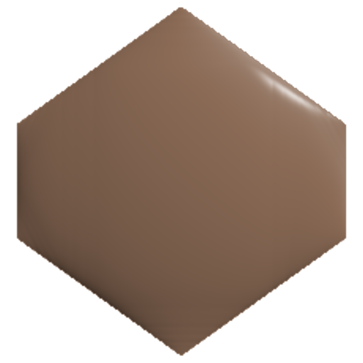
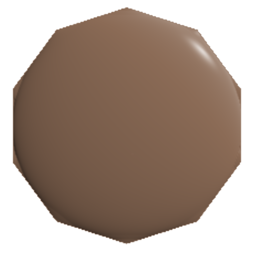

<changelog>

# Добро пожаловать!
Перед вами свод правил настольной ролевой игры "Набонассар".

##  Эпоха Скрытых Богов
Набонассар — это мир эпических легенд, рожденный в тени павших звезд. Вы — «серые», наследники великих пришельцев-шумеров, чьи технологии древние племена принимали за божественную волю. Исследуйте бескрайние пески, постигайте магию артефактов и помните: самые страшные чудовища и самые могущественные дары сокрыты в стальных катакомбах погребенного космического ковчега.

</changelog>

##  С чего начать?

Если вы здесь впервые, загляните в разделы [Введение](./intermission.md) и [Как играть?](./checks/checks.md), там описаны основы игры и её краткое описание. Для удобства по Ctrl+F доступен глобальный поиск по книге.

##  Инструменты и создание
Воспользуйтесь инструментами, чтобы подготовиться к сессии:

[Генератор персонажей](./editor/editor.html) — для быстрого старта.

[Конструктор способностей](./editor/editor.html) и [Редактор магии](./editor/editor.html) — для тонкой настройки героя.

##  Справочник
Всё о мире игры и его наполнении:
[Существа](./creatures/creatures.md), [Предметы](./items/items.md) и [Локации](./locations/locations.md).

##  Мастеру игры

Планируете вести партию? Изучите механику [Сцен](./scenes/common.md) и структуру [Приключений](./scenes/common.md), чтобы сделать историю незабываемой.

В таком интерфейсе лучше не делать его громоздким. Используй формат "Свитка событий" или компактного списка справа/снизу:
Вариант А: Справа от основного контента (если позволяет верстка) в виде узкой колонки «Вестник изменений».
Вариант Б: Внизу страницы в виде раскрывающегося списка (аккордеона), чтобы не занимать место.
Стиль оформления:
Версия 1.2.0 — Пробуждение ковчега (дата)
[+] Добавлены чертежи в раздел «Предметы».
[FIX] Исправлен расчет урона в генераторе персонажей.

футер:
Текст: «Есть вопросы по правилам или нашли баг в ковчеге? Присоединяйтесь к нашему [Discord] или [Telegram]».

